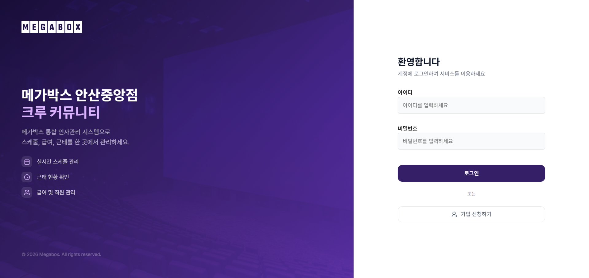
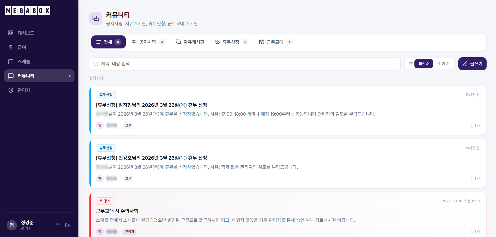
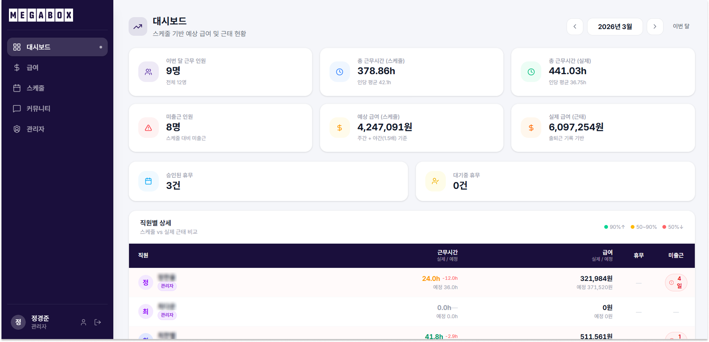

# Megabox - 안산지점 직원 관리 시스템

MEGABOX 안산지점 직원의 스케줄 관리, 급여 계산, 실시간 출퇴근 추적, 커뮤니티 기능을 하나의 플랫폼에서 제공하는 풀스택 웹 서비스입니다.

---

## Tech Stack

### Frontend

| Category      | Stack                                                |
| ------------- | ---------------------------------------------------- |
| Language      | TypeScript 5.9                                       |
| Framework     | React 19                                             |
| Build Tool    | Vite 7                                               |
| Architecture  | Feature-Sliced Design (FSD)                          |
| Styling       | Tailwind CSS 4 · shadcn/ui (Radix UI)                |
| Server State  | TanStack React Query 5                               |
| Client State  | Zustand 5                                            |
| HTTP          | Axios (JWT 자동 주입 · 토큰 갱신 큐)                 |
| Routing       | React Router 7                                       |
| Form          | React Hook Form · Zod                                |
| Date          | date-fns · dayjs                                     |
| Test          | Vitest · Testing Library                             |
| Lint / Format | ESLint (eslint-plugin-fsd-import) · Prettier · Husky |

### Backend

| Category      | Stack                                   |
| ------------- | --------------------------------------- |
| Language      | Python 3.13                             |
| Framework     | FastAPI 0.119                           |
| ORM           | SQLAlchemy 2.0                          |
| Migration     | Alembic                                 |
| Database      | MySQL                                   |
| Cache         | Redis                                   |
| Auth          | JWT (PyJWT) · bcrypt-sha256             |
| Encryption    | Cryptography (Fernet) — 주민번호 암호화 |
| Validation    | Pydantic v2                             |
| Server        | Uvicorn (ASGI)                          |
| Test          | pytest                                  |
| Lint / Format | Black · Flake8                          |

### Infrastructure

| Category      | Stack                   |
| ------------- | ----------------------- |
| Container     | Docker · Docker Compose |
| Reverse Proxy | Nginx                   |
| Tunnel        | Cloudflare Tunnel       |
| Monitoring    | Sentry                  |

---

## Architecture

### Frontend — Feature-Sliced Design (FSD)

상위 레이어는 하위 레이어에만 의존할 수 있으며, 동일 레이어 간 임포트는 `eslint-plugin-fsd-import`로 차단됩니다.

```
src/
├── app/        # 라우터, 전역 Provider, 레이아웃
├── pages/      # 라우트와 1:1 매핑되는 페이지 컴포넌트
├── widgets/    # 독립적인 UI 블록 조합 (여러 feature 조합)
├── features/   # 사용자 기능 단위 (API 호출 + UI 묶음)
├── entities/   # 비즈니스 엔티티 타입 및 기본 UI
└── shared/     # 공통 유틸, API 클라이언트, shadcn/ui 컴포넌트
```

**API 클라이언트** (`shared/api/`): Axios 인터셉터에서 JWT 자동 주입, 401 발생 시 Refresh Token으로 재발급 + 실패 요청 큐 처리.

### Backend — Module-based FastAPI

```
backend/app/
├── core/           # config, database, security, routers
└── modules/
    ├── auth/       # 로그인, 회원가입, 토큰 갱신
    ├── schedule/   # 스케줄 · 시프트 · 휴무
    ├── payroll/    # 급여 계산 및 명세
    ├── community/  # 게시글 · 댓글 · 공지
    ├── admin/      # 유저 관리 · 4대보험 요율
    ├── wage/       # 기본 시급 관리
    └── workstatus/ # 출퇴근 (키오스크 · system 계정 전용)
```

각 모듈은 `models.py → schemas.py → services.py → routers.py` 구조를 따릅니다.

**인증 흐름**: 회원가입 후 `pending → approved` 관리자 승인 필요, Access Token 12h + Refresh Token 7d (DB 저장).

---

## Features

### 1. 로그인 / 인증



- 회원가입 후 관리자 승인(`pending → approved`) 완료 시 서비스 이용 가능
- Access Token (12h) + Refresh Token (7d) 자동 갱신, 갱신 중 실패 요청은 큐 보관 후 재시도
- Zustand + localStorage 기반 인증 상태 영속화

---

### 2. 홈 대시보드


- 오늘의 출근 정보 및 근무 스케줄 요약
- 최근 공지사항 바로가기

---

### 3. 스케줄 관리


- 월별 캘린더 뷰로 전체 직원 스케줄 조회
- 시프트 등록 · 수정 · 삭제
- 휴무 신청 및 승인 처리

---

### 4. 급여 확인


- 실 근무 시간 기반 자동 급여 계산
- 4대보험 공제 내역 포함 월별 명세서 조회

---

### 5. 출퇴근 관리 (키오스크)


- 키오스크 전용 UI에서 직원 선택 → 출근 / 휴식 시작 / 복귀 / 퇴근 처리
- system 계정 JWT 전용 인증 (`require_system_user` 의존성)
- 퇴근 시 근무 시간 기반 급여 자동 누적

---

### 6. 커뮤니티



| 게시판      | 설명                                |
| ----------- | ----------------------------------- |
| 공지사항    | 관리자 전용 공지 작성 및 공유       |
| 자유게시판  | 직원 간 자유로운 게시글 · 댓글 작성 |
| 시프트 교환 | 시프트 교환 요청 등록 및 상호 승인  |
| 휴무 신청   | 휴무 신청 및 처리 현황 확인         |

<details>
<summary>세부 스크린샷 보기</summary>

**공지사항**


**자유게시판**


**시프트 교환**


**휴무 신청**


</details>

---

### 7. 마이페이지


- 개인 정보 및 프로필 사진 수정
- 비밀번호 변경

---

### 8. 관리자 페이지


- 직원 가입 승인 / 거절 / 역할(Role) 변경
- 기본 시급 및 4대보험 요율 설정

---

### 9. 관리자 대시보드



- 오늘 출근 현황 실시간 조회
- 직원별 월 근무 시간 및 급여 요약

---

## Getting Started

### Prerequisites

- Docker & Docker Compose
- (로컬 개발 시) Node.js 20+, Python 3.13

### 환경변수 설정

**`frontend/.env`**

```env
VITE_BASE_URL=http://localhost:8000
```

**`backend/.env`**

```env
DB_HOST=
DB_PORT=3306
DB_NAME=
DB_USER=
DB_PASSWORD=
JWT_SECRET_KEY=
SSN_SECRET_KEY=
CORS_ORIGINS=http://localhost:5173
HOLIDAY_API_KEY=
```

### 실행

```bash
# 전체 스택 (Docker)
docker-compose up --build

# 프론트엔드만 (로컬 개발)
cd frontend && npm install && npm run dev

# 백엔드만 (로컬 개발)
cd backend && pip install -r requirements.txt && uvicorn app.main:app --reload
```

---

## Project Structure

```
megabox-ansan/
├── frontend/
│   └── src/
│       ├── app/         # 라우터, 전역 Provider
│       ├── pages/       # 페이지 컴포넌트
│       ├── widgets/     # 독립적 UI 블록
│       ├── features/    # 기능 단위 모듈
│       ├── entities/    # 비즈니스 엔티티
│       └── shared/      # 공통 유틸, API 클라이언트, UI
├── backend/
│   └── app/
│       ├── core/        # 설정, DB, 보안, 라우터 등록
│       └── modules/     # auth, schedule, payroll, community, admin, ...
├── nginx/               # Nginx 설정
├── cloudflared/         # Cloudflare Tunnel 설정
└── docker-compose.yml
```

---

## Screenshot Guide

스크린샷은 `docs/images/` 디렉토리에 아래 파일명으로 저장하면 자동 반영됩니다.

| 파일명                | 화면            |
| --------------------- | --------------- |
| `login.png`           | 로그인          |
| `home.png`            | 홈 대시보드     |
| `schedule.png`        | 스케줄          |
| `payroll.png`         | 급여            |
| `work-status.png`     | 키오스크 출퇴근 |
| `community.png`       | 커뮤니티 메인   |
| `notice.png`          | 공지사항        |
| `freeboard.png`       | 자유게시판      |
| `shift.png`           | 시프트 교환     |
| `dayoff.png`          | 휴무 신청       |
| `mypage.png`          | 마이페이지      |
| `admin.png`           | 관리자 페이지   |
| `admin-dashboard.png` | 관리자 대시보드 |
